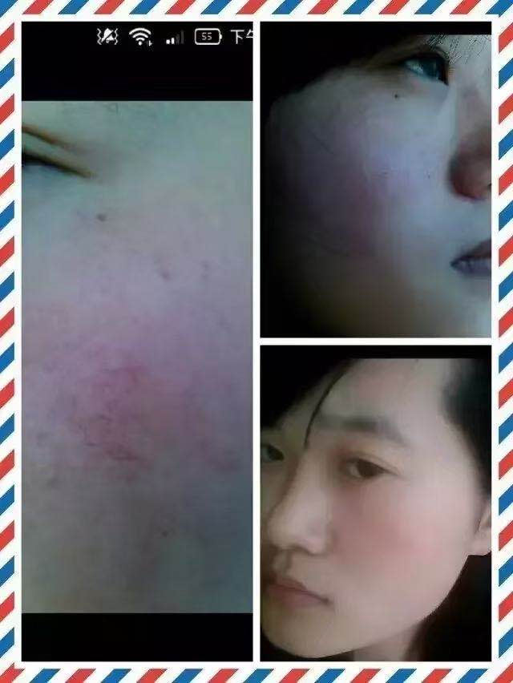

## 做水膜刺痛

这个是王琳，红血丝已经成面状了，属于挺严重得敏感肌肤了,调理的时候，滋润水，安瓶都有在用，然后皮肤开始红肿，一段时间后，蜕皮后，红肿下去了，皮肤比以前好,红肿程度和经历的时间，依据皮肤问题的严重程度来看，不用太害怕，可能有些人就是退个皮，发个红而已

皮肤在一段时间内被激活，然后起干皮，有点发红，有小红疹，闭合性粉刺长出来了，等，刚用产品的朋友大家都不要担心，以前的细胞处于半睡半醒状态，所以代谢慢(皮肤暗，闭合粉刺长不出来等现象)当滋润水中的核糖核酸和脱氧核糖核酸这些DNA活性成分进入后，就会激活提高代谢力，往外排东西，过程有点难受，但是就像蛇蜕皮一样，蜕完后就是重生

# 问题看似一致！，真正要解决皮肤问题，还是需要一对一的个性化皮肤护理方案
